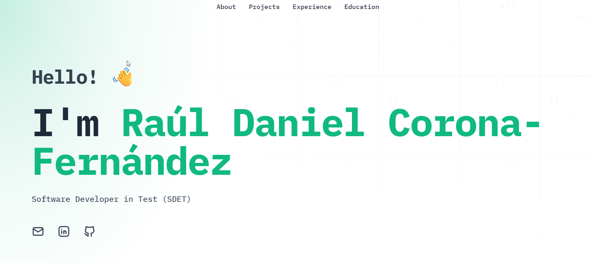

# Raúl Daniel Corona-Fernández - Professional Portfolio

Welcome to the source code of my professional portfolio. I am **Raúl Daniel Corona-Fernández**, Software Developer in Test (SDET) and Python Developer with over 7 years of experience specialising in test automation, Docker-based infrastructure, and CI/CD workflows.

This website is inspired by and built on the excellent [DevPortfolio Template](https://github.com/RyanFitzgerald/devportfolio) created by Ryan Fitzgerald. It uses **Astro** and **Tailwind CSS** to deliver a modern, fast, and minimalist web experience.

You can visit the live site at: [https://www.rdcoronaf.page/professional/](https://www.rdcoronaf.page/professional/)

## License

This project is fully and completely MIT. See LICENSE.md.
